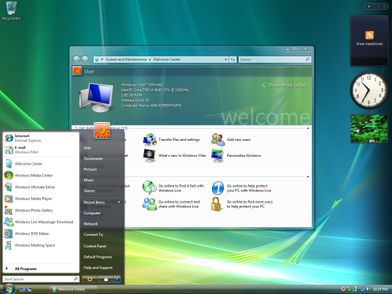
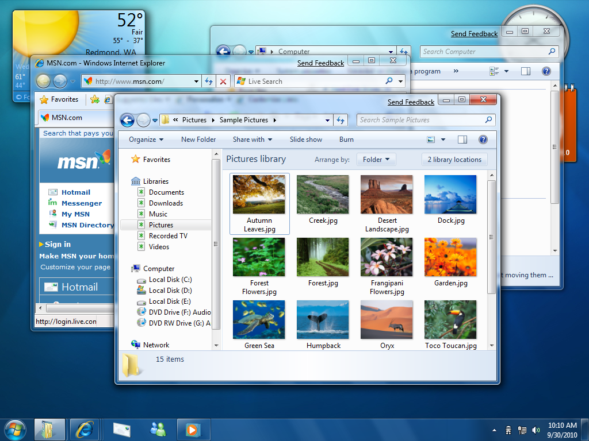
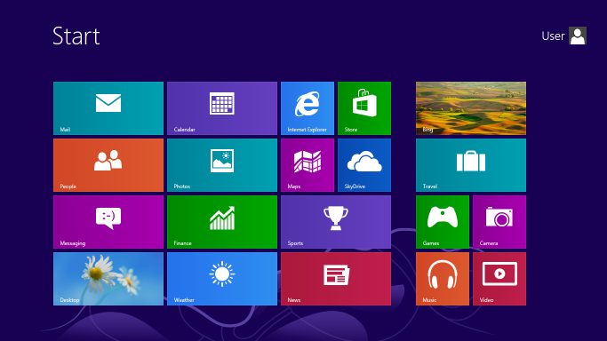

# 
**Sistemas Operativos**

### 
Dariel Armando Morua Ramírez 12119

---

## 
¿Qué hace un Sistema Operativo? 

Trabaja con los componentes de un equipo de computadora o dispositivo electrónico utilizando varios programas.

---
## 
¿Qué es el Open Source?

Es el software, que se distribuye con una licencia de código abierto que permite al usuario, si tiene las capacidades necesarias, poder utilizar el código fuente para modificarlo y realizar cambios y mejoras

---
## 
Comandos básicos de la terminal de Unix

<ul>
<li> cd</li>
  
Cambiar de directorio
<li> cd newFolder
  
Crea un directorio y lo abre en la ubicación actual
<li> history
  
Muestra el historial
 <li> rm fileName
  
Elimina el archivo con el nombre indicado
 <li> rm fileName
  
 Elimina un archivo con el nombre indicado
 <li> vim fileName 
  
  Abre un archivo con el editor vim

Muestra los archivos que se encuentran en tu ubicación
 <li> touch fileName 

Crea un archivo con el nombre que le indiques
 <li> pwd 

Nombra el nombre y la ruta del directorio en el que te encuentras
 <li >ls 

Enlista todos los archivos que se encuentran en el directorio actual
 <li> ls -la 

Hace lo mismo que ls pero agrega información extra y muestra carpetas ocultas

 <li>git init 

Inicializa un repositorio de git
<li> git add .

 Agrega todos los cambios nuevos que estan en nuestra maquina local
 <li >git commit -m “mensaje” </li>

Guarda un cambio de nuestro repositorio para subirlo a la nube
 <li> git push

 Sube los cambios a nuestro cliente remoto por ejemplo github

 </ul>

 ---

## 
Historia de los sistemas operativos Mac OS, Ubuntu y Windows

<ul>

 <li>Mac OS</li>

 Mac OS es el sistema operativo de computadoras de Apple, fue creado en 1984. Es un sistema operativo tipo UNIX.
 <ul>
  <li>La primera versión se llamó "System 1.0", tenía escritorio, ventanas, iconos, mouse, menús y scrollbars.</li>

 

<li>En 1985, se creó el "System 2.0" con mejoras de rendimiento y se agregaron más opciones como crear nuevos folders, los items eran listados de forma vertical con un icono, los discos podían ser arrastrados al icono de basura y podían ser extraídos.</li>

<li> En 1986 se mejoró a "System 3.0", el Finder fue mejorado y más rápido, el orden de archivos HFS fue reemplazado por el nuevo MFS. Se podían crear folders dentro de folders, los iconos con Zoom uferon agregados y se agregó AppleShare</li>

<li> Sistema 4 fue introducio como Macintosh SE y Macintosh II en 1987. Se le agregó múltiple soporte de monitor, soportaba discos de 32+ MB, se le implemento el Finder múltiple y ya mostraba cuanta memoria utilizaba cada programa.</li>

<li> Nos salteamos a 1997 donde se implementó el "primer Mac OS", el cual fue el Mac OS 8 que incluyó una renovación al Finder que podía hacer más cosas al mismo tiempo, dando la opción de controlas múltiples aplicaciones al mismo tiempo con un mejor desempeño y se introdujo Sherlock</li>

Desde 2001 hasta la actualidad se utiliza el Mac OS X que se va actualizando con el paso del tiempo. Al principio eran nombrado con felinos pero actualmente es con nombre de montañas

En 2001 fue lanzado el Mac OS X 10.0 "Cheetah", Mac OS X 10.1 "Puma". En 2002, el Mac OS X 10.2 "Jaguar". 2003, Mac OS X 10.3 "Panther" y actualmente contamos con el Mac OS X 13.0 "Ventura", se van actualizando periodicamente segun los requisitos del usuario y del Hardware
 </ul>

 
<li> Ubuntu</li>

 Ubuntu es un distro de Linux basado en Debian GNU, con software libre y de codigo abierto. El objetivo inicial era hacer de Debian una distribución más fácil de usar y entender para los usuarios finales, corrigiendo varios errores de este y haciendo más sencillas algunas tareas como la gestión de programas. Su primer lanzamiento fue el 20 de octubre de 2004 con nombre Warty Warthog.

 Cada seis meses se publica una nueva versión de Ubuntu. Esta recibe soporte por parte de Canonical durante nueve meses por medio de actualizaciones de seguridad, parches para bugs críticos y actualizaciones menores de programas. Las versiones LTS (Long Term Support), que se liberan cada dos años,​ reciben soporte durante cinco años en los sistemas de escritorio y de servidor.

<li> Windows</li>
<ul>
 <li>Microsoft Windows versión 1.0 de 1985, compitió con el sistema operativo de Apple. Carecía de un cierto grado de funcionalidad y logró muy poca popularidad. Windows 1.0 no era un sistema operativo completo; más bien era una extensión gráfica de MS-DOS.</li>

 

<li>Windows versión 2.0 fue lanzado en noviembre de 1987 incluyó por primera vez ventanas que podían solaparse unas a otras. El resultado de este cambio llevó a Apple a presentar una demanda contra Microsoft, debido a que infringían derechos de autor.</li>

 

<li>Windows versión 3.0, lanzado en 1990 presentaba mejoras en la interfaz de usuario y en la multitarea. </li>

 

<li>En 1995, Windows 95 fue la primera versión de Windows en incluir la barra de tareas y el botón Inicio, los cuales siguieron incluyéndose en versiones posteriores de Windows, además de ser la primera versión en soportar la función de Plug and Play.</li>

 

<li>En octubre de 2001, Microsoft lanzó Windows XP, una versión que se construyó en el kernel de Windows NT que también conserva la usabilidad orientada al consumidor de Windows 95 y sus sucesores.</li>

 

<li>El 30 de enero de 2007, Microsoft lanzó Windows Vista. Contiene un sinnúmero de características nuevas, a partir de un shell rediseñado, y la interfaz de usuario ofrece importantes cambios técnicos de envergadura, con especial atención a las características de seguridad. Está disponible en seis ediciones diferentes.</li>

 

<li>El 22 de octubre de 2009, Microsoft lanzó Windows 7 pretendía ser una actualización incremental, enfocada a la línea de Windows, con el objetivo de ser compatible con aplicaciones y hardware con los que Windows Vista no era compatible. </li>

 

<li>El 26 de octubre de 2012, Microsoft lanzó Windows 8. El mayor cambio introducido es el reemplazo del Menú Inicio por una pantalla de Inicio de tamaño completo, la cual incluye nuevas aplicaciones. Su uso está enfatizado para dispositivos con pantallas táctiles.</li>

 

<li>El 29 de julio de 2015, Microsoft lanzó Windows 10. Presenta un conjunto de aplicaciones y una interfaz que permite utilizarse en computadoras personales y dispositivos móviles. Visualmente es parecido a su predecesor, sin embargo, el Menú Inicio regresa en esta versión. Windows 10 introduce un nuevo navegador: Microsoft Edge, y un asistente de voz personal: Cortana, junto con una interfaz de sistema minimalista.</li>

 

<li>El 5 de octubre de 2021 salió Windows 11 que incorpora una interfaz de usuario basada en Fluent Design incluyendo transparencias, sombras, íconos redondeados en todo el sistema. El menú Inicio sufre un rediseño que elimina los tiles del lateral. Los iconos de la barra de tareas incluyendo en botón Inicio aparecen centrados en la mitad de la pantalla, un diseño que ha sido comparado al del dock de macOS.</li>

 

 </ul>
 

---

## 
 Dispositivos de Entrada/Salida 

 